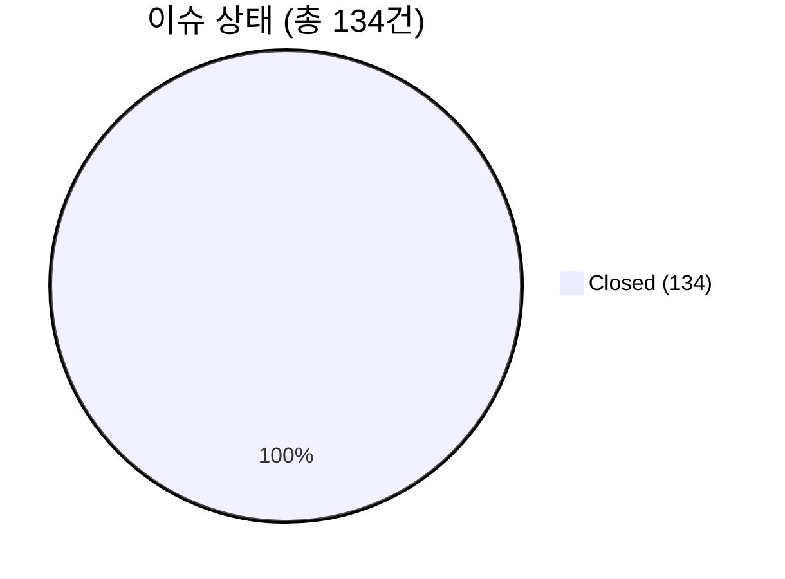
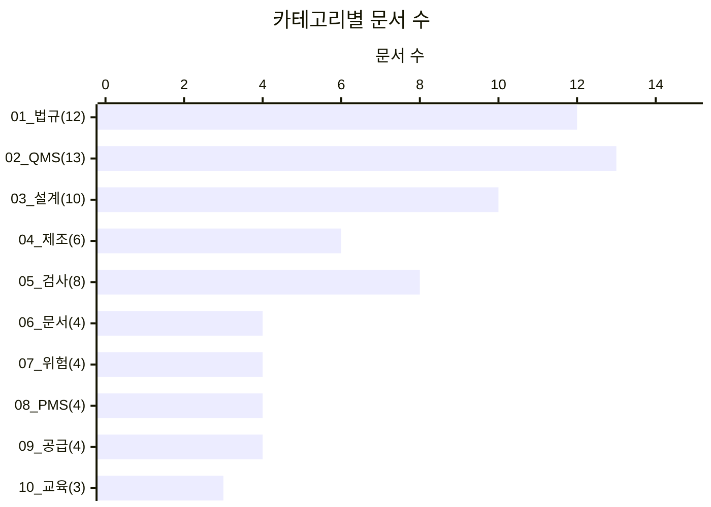
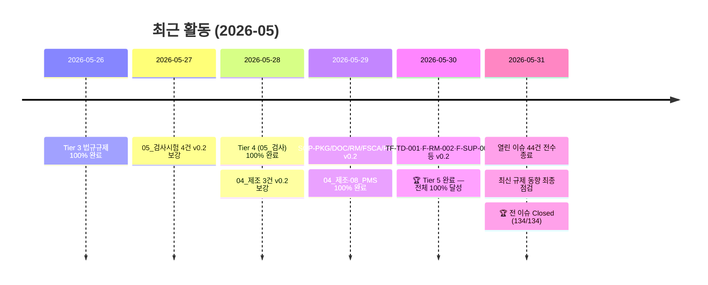

# 의료기기 제조 업무규칙 개발 프로젝트 (MD-process)

## 프로젝트 목적
의료기기 제조기업이 준수해야 할 법규·규제·품질관리 요구사항을 체계적으로 정리하고, 실무에 적용 가능한 내부 업무규칙(SOP·절차서·지침서)을 개발한다.

## 사업 영역
의료용 X-ray system / detector / SW 개발

## 적용 범위
- **국내**: 의료기기법, 의료기기 제조 및 품질관리 기준(MFDS 고시), 디지털의료제품법, 진단용 방사선 안전관리규칙(제1122호)
- **국제**: ISO 13485:2016, ISO 14971:2019, IEC 62304, IEC 62366-1, IEC 60601 시리즈 (특히 IEC 60601-2-54)
- **미국**: 21 CFR Part 820 → QMSR (2026.2.2 시행), FDA Premarket Cybersecurity, SBOM 의무화
- **유럽**: EU MDR 2017/745, EUDAMED, EU AI Act

## 폴더 구조
| 폴더 | 내용 |
|------|------|
| 00_프로젝트관리 | 프로젝트 개요, 색인, 이슈관리 규칙 |
| 01_법규_규제 | 국가·지역별 규제 요구사항 |
| 02_품질경영시스템_QMS | QMS 구축·운영, 변경통제, 사용적합성 |
| 03_설계_개발관리 | 설계이력파일(DHF), SW 수명주기, AI 거버넌스 |
| 04_제조공정_관리 | 공정관리, 밸리데이션, 클린룸 관리 |
| 05_검사_시험_밸리데이션 | 수입·공정·완제품 검사, 형식시험 |
| 06_문서_기록관리 | 문서통제, UDI 관리 |
| 07_위험관리_ISO14971 | 위험관리파일, FMEA |
| 08_시판후_감시_PMS | 부작용 보고, 사이버사고 PMS |
| 09_공급자_관리 | 공급자 평가·감사·SLA |
| 10_교육_훈련 | 인력 자격, 역량매트릭스 |
| 11_일일_리서치로그 | 일자별 리서치 기록 |
| 12_교차검증_보고서 | 규정 간 상호비교·정합성 |
| issue-drafts | GitHub Issue 자동 동기화용 드래프트 |
| .github/workflows | Actions 워크플로 (auto-issue.yml) |

## 자동화 시스템

### 스케줄링
- **process-project** 작업이 매일 03:18 KST 자동 실행
- `/tmp/wk-*` 신규 클론에서 작업 → main push → Actions 트리거

### 이슈 자동 동기화
- `issue-drafts/NNN_*.md` 작성·push 시 GitHub Issue 자동 생성
- frontmatter `state: closed` 추가 시 자동 close 처리
- `_log.json`에 파일명 ↔ 이슈번호 매핑 유지
- 워크플로: [`.github/workflows/auto-issue.yml`](.github/workflows/auto-issue.yml)

### 문서 매트릭스 (전체 현황 단일 진실원)
- **[`00_프로젝트관리/문서_매트릭스.md`](00_프로젝트관리/문서_매트릭스.md)** — 모든 문서의 ID·제목·유형·버전·상태·표준·양식·이슈·소유자·검토만료를 한 표로 자동 집계
- 각 문서 frontmatter(YAML)를 SSOT로 사용 → push마다 [`build-matrix.yml`](.github/workflows/build-matrix.yml)이 자동 재생성
- 작성 규칙: [`00_프로젝트관리/문서_메타데이터_규칙.md`](00_프로젝트관리/문서_메타데이터_규칙.md)

### HTML 대시보드 (회의·보고 자료용)
- **[🌐 holee9.github.io/MD-process](https://holee9.github.io/MD-process/)** — 브라우저에서 즉시 열리는 대시보드 (Chart.js 차트·인쇄 친화)
- push마다 [`deploy-pages.yml`](.github/workflows/deploy-pages.yml)이 자동 빌드·배포
- 회의·리뷰에서 그대로 영사 또는 인쇄 가능

### 운영 규칙
- [00_프로젝트관리/이슈관리_규칙.md](00_프로젝트관리/이슈관리_규칙.md)
- [issue-drafts/README.md](issue-drafts/README.md)

## 업무 프로세스
1. 매일 정해진 시간 - 최신 규제 동향 리서치 (`11_일일_리서치로그/`)
2. 카테고리별 문서 신규 작성 또는 v0.X 보강
3. 교차검증 (`12_교차검증_보고서/`)
4. 이슈 드래프트로 작업 이력 기록
5. push → Actions가 이슈 동기화 → 완료 작업 close 처리

## 기여 방법
- 이슈 등록: 새로운 규제 동향이나 개선사항은 `issue-drafts/NNN_*.md`로
- 풀 리퀘스트: 업무규칙 초안 또는 문서 수정 제출

## 라이선스
본 프로젝트의 모든 문서는 오픈소스로 제공되며, 의료기기 제조기업의 품질관리 개선을 위해 자유롭게 활용 가능합니다.

---

## 🖥 회의·보고에서 대시보드 사용

본 프로젝트는 **단일 진실원(Single Source of Truth)** 원칙으로 운영. 어떤 환경에서 보든 동일 컨텐츠.

### 1. 회의실·다른 PC에서 보기
브라우저로 접속: **https://holee9.github.io/MD-process/**
- 매 push 시 자동 갱신
- Chart.js 차트, KPI, Tier 진행, 잔여 보강 대상까지 풍부

### 2. 이메일·메신저로 공유
링크 또는 HTML 파일 첨부.
- **링크 공유:** 위 Pages URL 그대로
- **파일 다운로드:** 대시보드 페이지 상단의 "💾 HTML 다운로드" 버튼 또는 [`docs/index.html`](docs/index.html) raw 다운로드
- 인터넷 없는 환경에서도 HTML 파일을 더블클릭으로 열 수 있음 (Chart.js CDN만 있으면 차트 표시. 없어도 표·KPI는 정상 표시)

### 3. 인쇄·PDF 저장
대시보드 페이지 상단의 "🖨 인쇄 / PDF 저장" 버튼 클릭. 또는 브라우저 인쇄(Ctrl+P) → "PDF로 저장".
- 인쇄 친화 CSS 적용 (밝은 배경, 액션 버튼 자동 숨김)

### 4. Cowork 본인 PC에서 보기
사이드바의 Pinned "MD Process Dashboard" — GitHub Pages와 자동 동기 (스케줄러가 매일 03:18 KST 동기).

### 데이터 출처
- 각 문서의 `frontmatter` (version·status·doc-id·applicable 등) — 단일 진실원
- `00_프로젝트관리/_dashboard_config.yml` — 사업 정보 (목표일·Tier)
- `issue-drafts/*.md` + `_log.json` — 이슈 현황
- git log — 최근 활동·일별 속도
- 빌드 스크립트: [`scripts/build_dashboard_html.py`](scripts/build_dashboard_html.py)

---

## 📊 진행 현황 (자동 갱신)

> 마지막 갱신: **2026-05-31** · 프로젝트 목표일: 2026-06-01

### 한눈에 보기

### 🎯 프로젝트 목표 달성

> **🏆 전체 Tier 1-5 완료! 핵심 문서 v0.2+ 보강률 100% 달성 (68/68)**
> **🏆 전체 이슈 134건 Closed — 열린 이슈 0건 달성 (2026-05-31)**

### 카테고리별 문서 분포

### 카테고리별 충실도 (v0.2+ 기준)

| 카테고리 | 문서 수 | v0.2+ | 비율 | 진행 상태 |
|----------|--------|-------|------|----------|
| 01_법규_규제 | 12 | 12 | **100%** | `██████████` ✅ |
| 02_품질경영시스템_QMS | 13 | 13 | **100%** | `██████████` ✅ |
| 03_설계_개발관리 | 10 | 10 | **100%** | `██████████` ✅ |
| 04_제조공정_관리 | 6 | 6 | **100%** | `██████████` ✅ |
| 05_검사_시험_밸리데이션 | 8 | 8 | **100%** | `██████████` ✅ |
| 06_문서_기록관리 | 4 | 4 | **100%** | `██████████` ✅ |
| 07_위험관리_ISO14971 | 4 | 4 | **100%** | `██████████` ✅ |
| 08_시판후_감시_PMS | 4 | 4 | **100%** | `██████████` ✅ |
| 09_공급자_관리 | 4 | 4 | **100%** | `██████████` ✅ |
| 10_교육_훈련 | 3 | 3 | **100%** | `██████████` ✅ |
| **전체** | **68** | **68** | **100%** | `██████████` ✅ |

### Tier 마일스톤

| Tier | 카테고리 | 완료일 | 상태 |
|------|----------|--------|------|
| Tier 1 | 02_QMS | 2026-05-22 | ✅ |
| Tier 2 | 03_설계_개발관리 | 2026-05-24 | ✅ |
| Tier 3 | 01_법규_규제 | 2026-05-26 | ✅ |
| Tier 4 | 05_검사_시험_밸리데이션 | 2026-05-28 | ✅ |
| Tier 5 | 04_제조·06_문서·07_위험·08_PMS·09_공급·10_교육 | 2026-05-30 | ✅ |

### 카테고리 × 유형 매트릭스 미니뷰

| 카테고리 | SOP | Form | Guide | Matrix | Plan | 기타 | 합계 |
|----------|-----|------|-------|--------|------|------|------|
| 01_법규 | 0 | 0 | 6 | 4 | 0 | 2 | 12 |
| 02_QMS | 7 | 1 | 2 | 1 | 1 | 1 | 13 |
| 03_설계 | 5 | 0 | 3 | 0 | 0 | 2 | 10 |
| 04_제조 | 3 | 0 | 1 | 0 | 0 | 2 | 6 |
| 05_검사 | 3 | 0 | 1 | 1 | 1 | 2 | 8 |
| 06_문서 | 1 | 0 | 1 | 0 | 0 | 2 | 4 |
| 07_위험 | 1 | 1 | 1 | 0 | 0 | 1 | 4 |
| 08_PMS | 2 | 0 | 0 | 0 | 0 | 2 | 4 |
| 09_공급 | 0 | 1 | 1 | 0 | 0 | 2 | 4 |
| 10_교육 | 0 | 1 | 0 | 0 | 1 | 1 | 3 |

> 상세 매트릭스: [문서_매트릭스.md](00_프로젝트관리/문서_매트릭스.md)

### 최근 활동

### 시스템 헬스

| 항목 | 상태 | 비고 |
|------|------|------|
| GitHub Actions (issue sync) | 🟢 정상 | 마지막 실행 정상 |
| 스케줄러 (daily 03:18 KST) | 🟢 정상 | |
| Issue Auto-close | 🟢 정상 | `state: closed` 감지 시 자동 종료 |
| 매트릭스 빌드 | 🟢 정상 | push 시 자동 재생성 |
| 로컬 git | 🟢 정상 | /tmp 클론 사용 |

---

🔗 [Open Issues](https://github.com/holee9/MD-process/issues?q=is%3Aopen) · [Closed Issues](https://github.com/holee9/MD-process/issues?q=is%3Aclosed) · [Actions](https://github.com/holee9/MD-process/actions) · [문서 매트릭스](00_프로젝트관리/문서_매트릭스.md)
