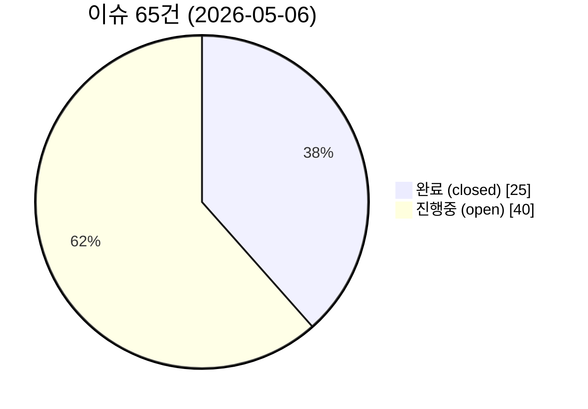
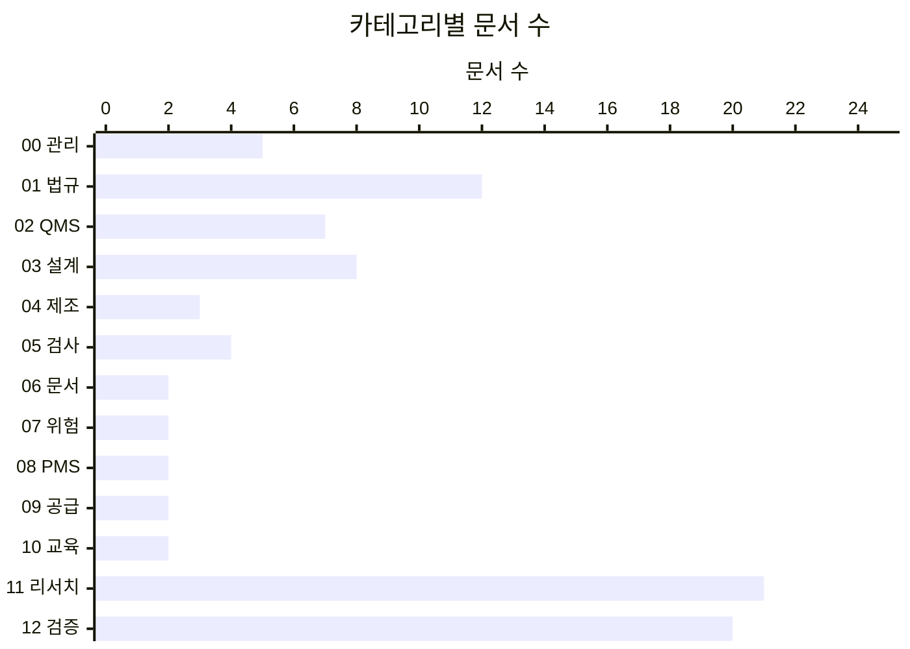
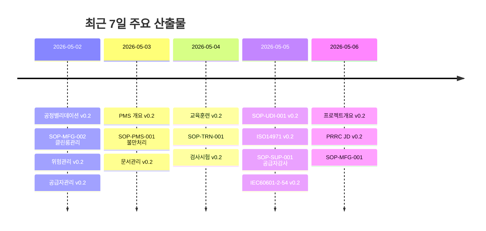
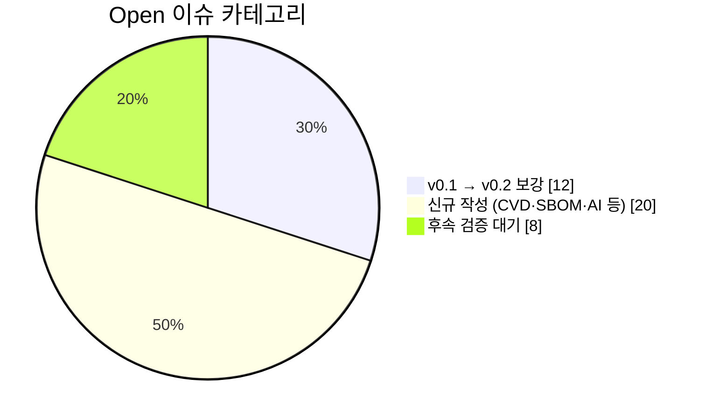

# 의료기기 제조 업무규칙 개발 프로젝트 (MD-process)

## 프로젝트 목적
의료기기 제조기업이 준수해야 할 법규·규제·품질관리 요구사항을 체계적으로 정리하고, 실무에 적용 가능한 내부 업무규칙(SOP·절차서·지침서)을 개발한다.

## 사업 영역
의료용 X-ray system / detector / SW 개발

## 적용 범위
- **국내**: 의료기기법, 의료기기 제조 및 품질관리 기준(MFDS 고시), 디지털의료제품법, 진단용 방사선 안전관리규칙(제1122호)
- **국제**: ISO 13485:2016, ISO 14971:2019, IEC 62304, IEC 62366-1, IEC 60601 시리즈 (특히 IEC 60601-2-54)
- **미국**: 21 CFR Part 820 → QMSR (2026.2.2 시행), FDA Premarket Cybersecurity, SBOM 의무화
- **유럽**: EU MDR 2017/745, EUDAMED, EU AI Act

## 폴더 구조
| 폴더 | 내용 |
|------|------|
| 00_프로젝트관리 | 프로젝트 개요, 색인, 이슈관리 규칙 |
| 01_법규_규제 | 국가·지역별 규제 요구사항 |
| 02_품질경영시스템_QMS | QMS 구축·운영, 변경통제, 사용적합성 |
| 03_설계_개발관리 | 설계이력파일(DHF), SW 수명주기, AI 거버넌스 |
| 04_제조공정_관리 | 공정관리, 밸리데이션, 클린룸 관리 |
| 05_검사_시험_밸리데이션 | 수입·공정·완제품 검사, 형식시험 |
| 06_문서_기록관리 | 문서통제, UDI 관리 |
| 07_위험관리_ISO14971 | 위험관리파일, FMEA |
| 08_시판후_감시_PMS | 부작용 보고, 사이버사고 PMS |
| 09_공급자_관리 | 공급자 평가·감사·SLA |
| 10_교육_훈련 | 인력 자격, 역량매트릭스 |
| 11_일일_리서치로그 | 일자별 리서치 기록 |
| 12_교차검증_보고서 | 규정 간 상호비교·정합성 |
| issue-drafts | GitHub Issue 자동 동기화용 드래프트 |
| .github/workflows | Actions 워크플로 (auto-issue.yml) |

## 자동화 시스템

### 스케줄링
- **process-project** 작업이 매일 03:18 KST 자동 실행
- `/tmp/wk-*` 신규 클론에서 작업 → main push → Actions 트리거

### 이슈 자동 동기화
- `issue-drafts/NNN_*.md` 작성·push 시 GitHub Issue 자동 생성
- frontmatter `state: closed` 추가 시 자동 close 처리
- `_log.json`에 파일명 ↔ 이슈번호 매핑 유지
- 워크플로: [`.github/workflows/auto-issue.yml`](.github/workflows/auto-issue.yml)

### 운영 규칙
- [00_프로젝트관리/이슈관리_규칙.md](00_프로젝트관리/이슈관리_규칙.md)
- [issue-drafts/README.md](issue-drafts/README.md)

## 업무 프로세스
1. 매일 정해진 시간 - 최신 규제 동향 리서치 (`11_일일_리서치로그/`)
2. 카테고리별 문서 신규 작성 또는 v0.X 보강
3. 교차검증 (`12_교차검증_보고서/`)
4. 이슈 드래프트로 작업 이력 기록
5. push → Actions가 이슈 동기화 → 완료 작업 close 처리

## 기여 방법
- 이슈 등록: 새로운 규제 동향이나 개선사항은 `issue-drafts/NNN_*.md`로
- 풀 리퀘스트: 업무규칙 초안 또는 문서 수정 제출

## 라이선스
본 프로젝트의 모든 문서는 오픈소스로 제공되며, 의료기기 제조기업의 품질관리 개선을 위해 자유롭게 활용 가능합니다.

---

## 📊 진행 현황 (자동 갱신)

> **마지막 갱신:** 2026-05-06 · **다음 자동 갱신:** 매일 03:18 KST

### 한눈에 보기

### 이슈 상태

### 카테고리별 문서 분포

### 카테고리별 충실도

| 카테고리 | 문서 | 진행도 |
|----------|:----:|:-------|
| 00 프로젝트관리 | 5 | `█████░░░░░` 50% |
| 01 법규·규제 | 12 | `██████████` 100% |
| 02 QMS | 7 | `███████░░░` 70% |
| 03 설계·개발 | 8 | `████████░░` 80% |
| 04 제조공정 | 3 | `███░░░░░░░` 30% |
| 05 검사·시험 | 4 | `████░░░░░░` 40% |
| 06 문서·기록 | 2 | `██░░░░░░░░` 20% |
| 07 위험관리 | 2 | `██░░░░░░░░` 20% |
| 08 PMS | 2 | `██░░░░░░░░` 20% |
| 09 공급자 | 2 | `██░░░░░░░░` 20% |
| 10 교육·훈련 | 2 | `██░░░░░░░░` 20% |

> 진행도 = 카테고리 내 충실도 추정치 (10단계). v0.2 보강 + SOP 신규까지 반영.

### 최근 활동 (timeline)

### 카테고리 × 유형 매트릭스

> 자세한 매트릭스는 [`00_프로젝트관리/문서_매트릭스.md`](00_프로젝트관리/문서_매트릭스.md) (자동 생성)

| 카테고리 \ 유형 | SOP | Form | Checklist | Matrix | Plan | Overview | Guide | JD | 합계 |
|---|:---:|:---:|:---:|:---:|:---:|:---:|:---:|:---:|---:|
| 00 관리 | · | · | · | · | · | 1 | 3 | 1 | **6** |
| 01 법규 | · | · | 1 | 3 | · | · | 8 | · | **12** |
| 02 QMS | 2 | 1 | · | 1 | 1 | · | 2 | · | **7** |
| 03 설계 | 3 | · | · | · | · | · | 5 | · | **8** |
| 04 제조 | 2 | · | · | · | · | · | 1 | · | **3** |
| 05 검사 | · | · | 1 | 1 | 1 | 1 | · | · | **4** |
| 06 문서 | 1 | · | · | · | · | 1 | · | · | **2** |
| 07 위험 | · | · | · | · | · | 1 | 1 | · | **2** |
| 08 PMS | 1 | · | · | · | · | 1 | · | · | **2** |
| 09 공급 | 1 | · | · | · | · | 1 | · | · | **2** |
| 10 교육 | 1 | · | · | · | · | 1 | · | · | **2** |
| 11 리서치 (Log×21) | · | · | · | · | · | · | · | · | **21** |
| 12 검증 (Report×20) | · | · | · | · | · | · | · | · | **20** |

### 시스템 헬스

| 구성요소 | 상태 |
|----------|:----:|
| GitHub Actions (auto-issue) | ✅ |
| 일일 스케줄러 (process-project) | ✅ |
| 이슈 자동 close 처리 | ✅ |
| 로컬 작업 폴더 git | ⚠ (자동 흐름 무관) |

### Open 이슈 분류 (40건)

🔗 [전체 Open 이슈 보기](https://github.com/holee9/MD-process/issues?q=is%3Aopen) · [Closed 이슈](https://github.com/holee9/MD-process/issues?q=is%3Aclosed) · [Actions](https://github.com/holee9/MD-process/actions)
